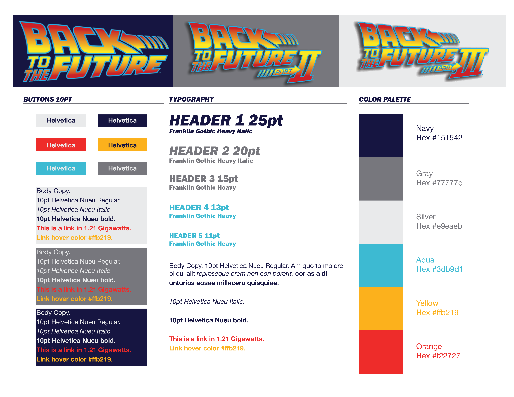

# Group Assignment: Webpage with Organized CSS Styles - Back to the Future Series

&nbsp;
# Challenges During Development

## Challenges faced were mainly with branching and commits from branches. 

* Everyone created their branches in a different way, either through github or git. There was confusion on forking versus branching.

* Olivia's branch dissappeared after the first commit and when trying to commit a second time a fatal error was shown and that the branch could not be committed to the main branch. 

* Amy was able to commit through her branches, but for some reason, multiple branches were made for commits, this only happened once.

* Jadelyn kept getting a fatal error when trying to commit her branch.

* Serena did not have issues with her branch and commits, but we were not sure if this was because she was the repo creator.

* Creating a unified CSS file was difficult with each person having some unique coding/elements for their pages.

* Each collaborator wanted to have a page reflecting their own coding style, so the group agreed to have certain elements be unified like the nav bar and image gallery across the pages.

* Amy, Olivia and Jadelyn commited changes as they were working, Serena commited once the  majority of her coding was complete.

&nbsp;
## Website Style Guide

&nbsp;

&nbsp;
## Website Wireframe

&nbsp;

&nbsp;
## Instructions
Groups will be selected by your instructor and consist of 3-4 members per group. The preferred method of communication between yourself and your classmates will be up to you and your group members. Email, Discord, or even group text messages are excellent sources for asynchronous communication. You may also video conferencing services like Zoom to organize live meetings with your group.  Zoom's free tier limits calls between 3 or more participants to 45 minutes, but you may simply restart the call for another 45 minutes if your call ends prematurely. You should select a leader for your group. The group leader will be responsible for creating and setting up the GitHub repository, as well as reviewing pull requests. The group leader will also have the final say over design and implementation details for your project in the event the group cannot reach a consensus on a particular decision. That said, the group leader should ensure that all group members are encouraged to contribute to the design and development of the project. The group leader will also be responsible for creating a git repository with a professional-sounding title and adding each group member to the repository as a contributor. The group leader will also set up a branch protection rule for the main branch and ensure at least one contributor must approve changes before merging the pull request into the main branch. Each group member will then clone the project repository to his/her computer. When working on the project, each member should create a branch locally for a feature he/she is working on, using git commits as necessary for any completed milestones on the way to implementing the desired feature. Then, the group member should push the changes to GitHub and create a pull request to be reviewed by the other group members before merging to the main branch. Allowing group members to push changes directly to the main branch is strongly discouraged. Instructions For this project, you and your group will design, code, and deploy a website for or related to your favorite movie or TV show. To receive full-credit for this project, your group must create and submit:

    1. A style guide for your website.
    2. Any wireframes or mockups that were used in the creation of your site.
    3. A website for or related to a TV show or movie that has at least 4 unique pages. 2 The submitted website must also:
    4. Be responsive on both tablet and cell-phone sized screens.
    5. Use CSS flexbox at least once.
    6. Use semantic HTML tags where appropriate.
    7. Utilize BEM naming conventions for its CSS rules.
    8. Include at least one usage of CSS transitions.
    9. Include at least one usage of CSS animations.
    10. Include a README in the GitHub repository for the project that details any challenges encountered during development as well as a link to the deployed website. 
    11. Additionally, all group members must have a similar amount of git commits to the project to receive full-credit. The instructor will review the git history of the project on GitHub to ensure that all group members fairly contributed to the project. Any glaring disparities in the commit history of the project must be justified in the README for the project. 

Deployment 
Your group leader must deploy your site to GitHub Pages. 

To deploy a repository to GitHub pages:
    12. Ensure your repository has an index.html file in the root directory.
    13. Navigate to the settings section of the repository.
    14. Click on pages in the left navigation menu.
    15. Under source click the dropdown and select your master or main branch.
    16. Click save. Your site should be deployed to <your leader's github username>.github.io/ in 5-10 minutes.
